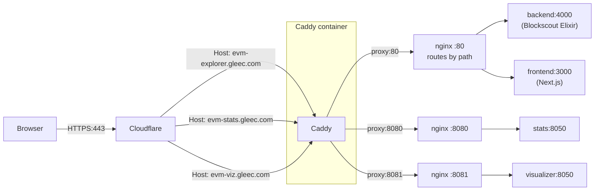

# GLEEC Blockscout deployment notes

This deployment publishes a Blockscout explorer for the GLEEC EVM chain
(`CHAIN_ID=11169`) behind Cloudflare. TLS termination is split between
Cloudflare (public edge) and a Caddy container running inside the same
Docker Compose stack as Blockscout. Cloudflare is configured with
**SSL/TLS encryption mode: Full (strict)**.

The whole stack is defined under [docker-compose/](docker-compose/);
Caddy is added on top via [docker-compose/services/caddy.yml](docker-compose/services/caddy.yml).

## Three public hostnames

| Hostname                    | Purpose                       | Caddy upstream | Final service                           |
| --------------------------- | ----------------------------- | -------------- | --------------------------------------- |
| `evm-explorer.gleec.com`      | Main UI + main API + sockets  | `proxy:80`     | `frontend:3000` and `backend:4000` (split inside the `proxy` nginx by path: `/api*`, `/socket`, `/sitemap.xml`, `/auth/*` go to backend; everything else to frontend) |
| `evm-stats.gleec.com`     | Blockscout `stats` microservice (charts, counters, daily activity) | `proxy:8080`   | `stats:8050`                            |
| `evm-viz.gleec.com`       | Blockscout `visualizer` microservice (Solidity/EVM diagrams) | `proxy:8081`   | `visualizer:8050`                       |

All three share the **same** Cloudflare Origin Certificate
`*.gleec.com` mounted into Caddy from
[ssl/](ssl/) (which is a symlink pointing at `/home/tech/ssl`):

```
/home/tech/blockscout/ssl/gleec.com/ssl.pem
/home/tech/blockscout/ssl/gleec.com/ssl.key
```

The wildcard covers exactly one label, so all three names are valid
under it; nested subdomains like `stats.evm-explorer.gleec.com` would not
fit and are intentionally avoided.

## Request flow



Notes on the legs:

- The path-based split inside the `proxy` nginx for `:80` lives in
  [docker-compose/proxy/explorer.conf.template](docker-compose/proxy/explorer.conf.template)
  (and [docker-compose/proxy/default.conf.template](docker-compose/proxy/default.conf.template)).
- The `:8080` / `:8081` server blocks live in
  [docker-compose/proxy/microservices.conf.template](docker-compose/proxy/microservices.conf.template).
- The microservice nginx bakes in `Access-Control-Allow-Origin: http://localhost(:3000)`,
  which is wrong for our public origin. Caddy rewrites it on the fly:
  it answers `OPTIONS` preflights itself with the correct CORS headers,
  and on actual responses it overwrites
  `Access-Control-Allow-Origin: https://evm-explorer.gleec.com`
  using the `>` operator (unconditional set) in `header_down`.
- The visualizer leg keeps the long upstream timeouts that exist in
  the nginx template (`proxy_*_timeout 30m`, `proxy_buffering off`)
  via Caddy `transport http { read_timeout 30m; write_timeout 30m }`
  and `flush_interval -1`.

## Caddy <-> Blockscout networking

Caddy joins the default Docker Compose network
(`docker-compose_default`, `172.18.0.0/16`) and reaches the upstream
containers by their service names:

- `proxy:80`, `proxy:8080`, `proxy:8081`

The `proxy` container also publishes those ports on the host, but
**only on `127.0.0.1`** (`127.0.0.1:3000->80`, `127.0.0.1:8080->8080`,
`127.0.0.1:8081->8081`). Public ingress goes only through Caddy on
`0.0.0.0:80` and `0.0.0.0:443` (`0.0.0.0:443/udp` for HTTP/3).

## Real client IP from Cloudflare

In Caddy's global `servers` block we trust **only** Cloudflare's
published IPv4/IPv6 ranges (snapshot taken from
`https://www.cloudflare.com/ips-v4` and `/ips-v6`) and use
`CF-Connecting-IP` to derive `{client_ip}`:

```
servers {
    trusted_proxies static <CF v4 prefixes...> <CF v6 prefixes...>
    client_ip_headers CF-Connecting-IP
    trusted_proxies_strict
}
```

`trusted_proxies_strict` makes Caddy ignore any `CF-Connecting-IP` /
`X-Forwarded-*` it receives from a non-Cloudflare source. So a direct
hit to the host bypassing Cloudflare cannot spoof the client IP.

## Frontend wiring

The Blockscout frontend image emits a runtime config file
`/app/public/assets/envs.js` at container start, baking
`NEXT_PUBLIC_*` environment variables into JS that the browser fetches.
Therefore changes to
[docker-compose/envs/common-frontend.env](docker-compose/envs/common-frontend.env)
take effect by recreating the `frontend` container:

```bash
sudo docker compose -f docker-compose/docker-compose.yml \
  up -d --force-recreate frontend
```

Relevant variables:

```
NEXT_PUBLIC_APP_HOST=evm-explorer.gleec.com
NEXT_PUBLIC_API_HOST=evm-explorer.gleec.com
NEXT_PUBLIC_API_PROTOCOL=https
NEXT_PUBLIC_API_WEBSOCKET_PROTOCOL=wss
NEXT_PUBLIC_STATS_API_HOST=https://evm-stats.gleec.com
NEXT_PUBLIC_VISUALIZE_API_HOST=https://evm-viz.gleec.com
```

`NEXT_PUBLIC_STATS_API_HOST` and `NEXT_PUBLIC_VISUALIZE_API_HOST`
must be full origins (no path, default port 443). The frontend
hard-codes `/api/v1/...` paths under those origins; there is no
base-path knob for them.

## Operating Caddy

Caddy is just another Compose service. Common ops:

```bash
# Reload config without restart (picks up Caddyfile changes)
sudo docker compose -f docker-compose/docker-compose.yml \
  exec caddy caddy reload --config /etc/caddy/Caddyfile

# Validate Caddyfile without touching the running instance
sudo docker run --rm \
  -v /home/tech/blockscout/Caddyfile:/etc/caddy/Caddyfile:ro \
  -v /home/tech/blockscout/ssl:/etc/caddy/ssl:ro \
  caddy:2.11-alpine \
  caddy validate --config /etc/caddy/Caddyfile

# Tail Caddy logs
sudo docker logs -f caddy
```

### Caddy log retention

Caddy is the public ingress and writes one access-log line per request,
so its container log can grow quickly. The Compose definition caps it
via the Docker `json-file` driver:

```yaml
caddy:
  logging:
    driver: json-file
    options:
      max-size: "20m"
      max-file: "5"
      compress: "true"
```

That's at most 5 rotated files of 20 MB each (≈100 MB raw, much less on
disk thanks to gzip compression of rotated files) per container
lifetime. Tune these knobs in
[docker-compose/docker-compose.yml](docker-compose/docker-compose.yml)
if traffic patterns change. To inspect actual on-disk usage:

```bash
sudo du -sh "$(sudo docker inspect --format '{{.LogPath}}' caddy)"*
```

## Smoke tests

Run from the host. `--resolve` is used so the calls hit the local
Caddy directly, bypassing Cloudflare; this proves the origin works
end-to-end without depending on edge state. `-k` is needed because
the certificate is a Cloudflare Origin cert (not signed by a public
CA, so curl's default trust store does not chain it).

### 1. DNS sanity (through Cloudflare)

```bash
for h in evm-explorer.gleec.com evm-stats.gleec.com evm-viz.gleec.com; do
  printf '%-30s -> %s\n' "$h" "$(dig +short "$h" | head -3 | tr '\n' ' ')"
done
```

Expected: each hostname resolves to Cloudflare anycast IPs.

### 2. HTTP -> HTTPS redirect on the main host

```bash
curl -sI -H 'Host: evm-explorer.gleec.com' http://127.0.0.1/ | head -5
```

Expected: `HTTP/1.1 308 Permanent Redirect` with `Location: https://evm-explorer.gleec.com/`.

### 3. Main UI / API through Caddy

```bash
curl -skI --resolve evm-explorer.gleec.com:443:127.0.0.1 \
  https://evm-explorer.gleec.com/ | head -5

curl -sk --resolve evm-explorer.gleec.com:443:127.0.0.1 \
  https://evm-explorer.gleec.com/api/v2/stats \
  -w '\nhttp=%{http_code}\n' | tail -2
```

Expected: `HTTP/2 200` for `/`, JSON with `total_blocks` etc. for `/api/v2/stats`.

### 4. Stats microservice over its own origin

```bash
curl -sk --resolve evm-stats.gleec.com:443:127.0.0.1 \
  https://evm-stats.gleec.com/api/v1/pages/main \
  -w '\nhttp=%{http_code}\n' | tail -2
```

Expected: JSON with `average_block_time`, `total_blocks`, etc., HTTP 200.

### 5. CORS preflight (handled in Caddy, never hits upstream)

```bash
curl -ski --resolve evm-stats.gleec.com:443:127.0.0.1 \
  -X OPTIONS \
  -H 'Origin: https://evm-explorer.gleec.com' \
  -H 'Access-Control-Request-Method: GET' \
  -H 'Access-Control-Request-Headers: content-type,authorization' \
  https://evm-stats.gleec.com/api/v1/pages/main \
  | sed -n '1,/^\r$/p' | tr -d '\r' \
  | grep -iE '^(HTTP|access-control)'
```

Expected:

```
HTTP/2 204
access-control-allow-credentials: true
access-control-allow-headers: ...,Authorization,x-csrf-token
access-control-allow-methods: PUT, GET, POST, OPTIONS, DELETE, PATCH
access-control-allow-origin: https://evm-explorer.gleec.com
access-control-max-age: 1728000
```

Same shape for `evm-viz.gleec.com`.

### 6. CORS on a real GET (Caddy rewrites upstream's `localhost`)

```bash
curl -ski --resolve evm-stats.gleec.com:443:127.0.0.1 \
  -H 'Origin: https://evm-explorer.gleec.com' \
  https://evm-stats.gleec.com/api/v1/pages/main \
  | sed -n '1,/^\r$/p' | tr -d '\r' \
  | grep -iE '^(HTTP|access-control|server|via)'
```

Expected:

```
HTTP/2 200
access-control-allow-credentials: true
access-control-allow-origin: https://evm-explorer.gleec.com
server: nginx/1.29.8
via: 1.1 Caddy
```

The `server: nginx/.../via: 1.1 Caddy` pair confirms the chain
(browser -> Caddy -> nginx in `proxy` -> `stats`).

### 7. Frontend really uses the new origins

```bash
curl -sk --resolve evm-explorer.gleec.com:443:127.0.0.1 \
  https://evm-explorer.gleec.com/assets/envs.js \
  | grep -E 'NEXT_PUBLIC_(STATS|VISUALIZE)_API_HOST'
```

Expected:

```
NEXT_PUBLIC_VISUALIZE_API_HOST: "https://evm-viz.gleec.com",
NEXT_PUBLIC_STATS_API_HOST: "https://evm-stats.gleec.com",
```

If these lines still point at the old `:8080`/`:8081` URLs, the
`frontend` container has not been recreated since the last edit of
[docker-compose/envs/common-frontend.env](docker-compose/envs/common-frontend.env).

### 8. End-to-end via Cloudflare

Same calls as above, but without `--resolve`, e.g.:

```bash
curl -sI https://evm-explorer.gleec.com/ | head -5
curl -s  https://evm-stats.gleec.com/api/v1/pages/main \
  -H 'Origin: https://evm-explorer.gleec.com' \
  -o /dev/null -w 'http=%{http_code}\n'
```

This exercises the full `browser -> Cloudflare -> Caddy -> proxy ->
microservice` path and confirms Cloudflare's Full (strict) mode is
satisfied with the origin certificate.

## Disabled services

### `nft_media_handler`

The `nft_media_handler` service is **commented out** in
[docker-compose/docker-compose.yml](docker-compose/docker-compose.yml).
Reason: it requires `NFT_MEDIA_HANDLER_NODES_MAP` to contain at least
one worker node, and we have not deployed any worker nodes for this
chain. With the variable empty/unset the container crash-loops with:

```
NFT_MEDIA_HANDLER_NODES_MAP must contain at least one node
```

The `backend` is still started with
`NFT_MEDIA_HANDLER_ENABLED=true` /
`NFT_MEDIA_HANDLER_REMOTE_DISPATCHER_NODE_MODE_ENABLED=true` in
[docker-compose/envs/common-blockscout.env](docker-compose/envs/common-blockscout.env),
which is harmless on its own — without a worker available, NFT media
fetching simply does not happen, but nothing else breaks.

To re-enable later:

1. Provision at least one worker node (or run the
   `nft_media_handler` container with a populated
   `NFT_MEDIA_HANDLER_NODES_MAP` pointing at a reachable Erlang node).
2. Uncomment the `nft_media_handler:` block in
   [docker-compose/docker-compose.yml](docker-compose/docker-compose.yml).
3. `sudo docker compose -f docker-compose/docker-compose.yml up -d nft_media_handler`.
